# Introduction
This notebook records the Non-thresholded Gene set Enrichment Analysis and visualization of the result of Gene set Enrichment Analysis of the ranked genes from Assignment 2. 

In general, the original data with ID [GSE199089](https://www.ncbi.nlm.nih.gov/geo/query/acc.cgi?acc=GSE199089)[@Cheng2022], was found in the [GEO](https://www.ncbi.nlm.nih.gov/geo/) database, published by a [paper](https://pubmed.ncbi.nlm.nih.gov/35534729/)[@Cheng2022] (please click the link to access), which performs gene expression analysis of lung cancer H1299 cells in response to the presence or absence of glutamine or glucose or NH4+. There are 15 replicates with condition Gln/-, Glu/-, Glu/Gln, Glu/NH4+, control. The data is mainly for comparing the differential expression of genes under different treatment of glutamine or glucose or NH4+. 

In the Assignment 1, the following steps were performed to process the data:

- Compute quality control statistics to assess data quality
- Map the original Gene symbols (Ensembl ID) to HUGO gene symbols and deal with abnormal situations
- Clean the data by removing outliers or data with significant errors
- Apply normalization on the data and generate the data frame as required

The data has HUGO gene symbols as its row names, sample IDs/conditions as its column names, each cell of the matrix contains the normalized expression value of each gene in each sample (shown in the following Figure). 

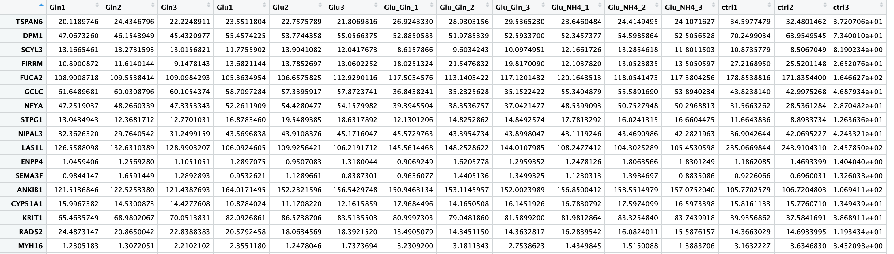

In Assignment 2, the differential Gene expression analysis were performed first on normalized data from Assignment 1 using edgeR package, then for genes that have significant up-regulated/down-regulated genes, the Thresholded over-representation analysis were performed by using gprofiler2 package. Generally, scoring in Assignment 2 gives me the metrics to sort the data to generate the ranked genes, which will be used in this assignment for non-thresholded gene set enrichment analysis.

First, we need to install all required packages.

Install all necessary packages[@BiocManager] [@knitr] [@edgeR] [@ggplot2] [@dplyr] [@ggrepel] [@gprofiler2] [@complexheatmap] [@circlize] [@RCurl]:
```{r, error=FALSE, message=FALSE, warning=FALSE}
# Check if all required packages are installed and install them if not
if (!require("BiocManager", quietly = TRUE))
    install.packages("BiocManager")

if (!require("edgeR", quietly = TRUE))
    BiocManager::install("edgeR")

if (!require("knitr", quietly = TRUE))
    install.packages("knitr")

if (!require("ggplot2", quietly = TRUE))
    install.packages("ggplot2")

if (!require("dplyr", quietly = TRUE))
    install.packages("dplyr")

if (!require("ggrepel", quietly = TRUE))
    install.packages("ggrepel")

if (!require("gprofiler2", quietly = TRUE))
    install.packages("gprofiler2")

if (!require("ComplexHeatmap", quietly = TRUE))
    BiocManager::install("ComplexHeatmap")

if (!require("circlize", quietly = TRUE))
    install.packages("circlize")

if (!require("tidyverse", quietly = TRUE))
    install.packages("tidyverse")

if (!require("RCurl", quietly = TRUE))
    install.packages("RCurl")


library(edgeR)
library(knitr)
library(ggplot2)
library(dplyr)
library(ggrepel)
library(gprofiler2)
library(ComplexHeatmap)
library(circlize)
library(RCurl)
```

**The following chunk of code is adapted from Assignment2 to generate the ranked set of genes.**

```{r, error=FALSE, message=FALSE, warning=FALSE}

# These are the codes adapted from assignment 2 for the ranked genes
normalized_expression_matrix_HUGO <- readRDS("normalized_expression_matrix_HUGO.rds")
normalized_expression_matrix_HUGO <- cbind(normalized_expression_matrix_HUGO, symbol = rownames(normalized_expression_matrix_HUGO))

# define group names/IDs
group <- c("Gln", "Gln", "Gln", "Glu", "Glu", "Glu", "Glu_Gln", "Glu_Gln", 
           "Glu_Gln", "Glu_NH4", "Glu_NH4", "Glu_NH4", "ctrl", "ctrl", "ctrl")

# indicate the model and design used for the analysis
y <- DGEList(counts=normalized_expression_matrix_HUGO[,1:15],group=group)
design <- model.matrix(~0+group)
y <- estimateDisp(y,design)
colnames(design) <- levels(y$samples$group)
fit <- glmQLFit(y, design)

# define the contrast condition 
my.contrasts <- makeContrasts(Glnvsctrl=Gln-ctrl, Gluvsctrl=Glu-ctrl, Glu_Glnvsctrl=Glu_Gln-ctrl, Glu_NH4vsctrl=Glu_NH4-ctrl, levels=design)

# perform the analysis for each group of comparison, *** vs control, use BH method to adjust
qlf.Glnvsctrl <- glmQLFTest(fit, contrast=my.contrasts[,"Glnvsctrl"])
Glnvsctrl_result <- topTags(qlf.Glnvsctrl, adjust.method = "BH", n = length(rownames(qlf.Glnvsctrl$table)))

qlf.Gluvsctrl <- glmQLFTest(fit, contrast=my.contrasts[,"Gluvsctrl"])
Gluvsctrl_result <- topTags(qlf.Gluvsctrl, adjust.method = "BH", n = length(rownames(qlf.Gluvsctrl$table)))

qlf.Glu_Glnvsctrl <- glmQLFTest(fit, contrast=my.contrasts[,"Glu_Glnvsctrl"])
Glu_Glnvsctrl_result <- topTags(qlf.Glu_Glnvsctrl, adjust.method = "BH", n = length(rownames(qlf.Glu_Glnvsctrl$table)))

qlf.Glu_NH4vsctrl <- glmQLFTest(fit, contrast=my.contrasts[,"Glu_NH4vsctrl"])
Glu_NH4vsctrl_result <- topTags(qlf.Glu_NH4vsctrl, adjust.method = "BH", n = length(rownames(qlf.Glu_NH4vsctrl$table)))


# Use the result of Glucose and Glutamin vs control to generate ranked gene list
result_to_use <- Glu_Glnvsctrl_result$table

result_to_use <- cbind(result_to_use, symbol=rownames(result_to_use))

# calculate the rank values and sort them
result_to_use[,"rank"] <- -log(result_to_use$PValue,base = 10) * sign(result_to_use$logFC)
result_ora <-
  result_to_use[order(result_to_use$rank, decreasing = TRUE),]

# remove symbols that are ""
result_ora <- result_ora[result_ora$symbol != "",]

# save the eanked list out
write.table(x=data.frame(genename = result_ora$symbol,
                         F_stat = result_ora$rank),
            file = file.path("ranked_genelist.rnk"),
            sep = "\t",row.names = FALSE,
            col.names = FALSE,quote = FALSE)
```


# Non-thresholded Gene Set Enrichment Analysis

Non-thresholded gene set enrichment analysis is going to be conducted using the ranked set of genes from the Assignment 2 codes above. Among many methods for the Gene Set Enrichment Analysis, I decided to use the GSEA method, which is a well-known and widely-used method[@gsea]. Generally, two files are required for the GSEA, a rank file (.rnk) and a pathway definition file (.gmt).

To generate a rank file (.rnk), a score (-log10(pvalue) * sign(logFC)) was calculated from the edgeR differential expression results from Assignment 2. A gene that is significantly differentially expressed will be assigned a high score. The sign of the logFC indicates if the gene has an higher or lower expression. It is used to rank the genes from top up-regulated to top down-regulated. This is is generated from Assignment 2 and the codes can be found in the above code chunk. The data format is shown below in Figure.1.

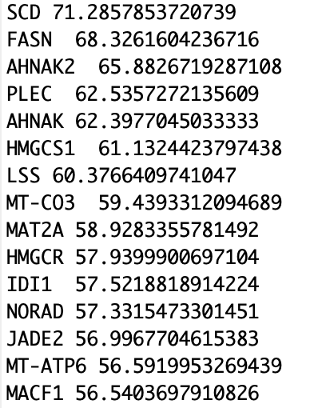

There is no need to generate a pathway definition file manually in this assignment, since the gene pathway definition file is downloaded directly from the [Dr.Bader's Lab website](http://download.baderlab.org/EM_Genesets/current_release/Human/symbol/). It contains various gene-sets obtained from MsigDB-c2, NCI, Biocarta, Netpath, HumanCyc, Reactome and the Gene Ontology (GO) databases etc., which is a well-maintained and well-established resource for the pathway data. the .gmt file downloaded is a tab delimited text file which contains one gene-set per row. For each gene-set (row), the first 2 columns contain the name and the description of the gene-set and the remaining columns contain the list of genes included in the gene-set. I am going to start with the human pathway definition with GO biological processes, but without IEA (inferred from electronic annotation). 

First, I need to download the pathway definition file:
```{r, error=FALSE, message=FALSE, warning=FALSE}
gmt_url <- "http://download.baderlab.org/EM_Genesets/current_release/Human/symbol/"

# list all files on the server
filenames <- getURL(gmt_url)
tc <- textConnection(filenames)
contents <- readLines(tc)
close(tc)

# get the .gmt file and download, GOBP without iea
rx <- gregexpr("(?<=<a href=\")(.*.GOBP_AllPathways_withPFOCR_no_GO_iea.*.)(.gmt)(?=\">)", contents,
               perl = TRUE)
gmt_file <- unlist(regmatches(contents, rx))
dest_gmt_file <- file.path(".", gmt_file)
download.file(paste(gmt_url, gmt_file, sep = ""), destfile = dest_gmt_file)
```

After downloaded the pathway definition file, the GSEA is going to be performed locally on my computer, since I am using an M1 chip MacBook, and I am using the arm64 image for docker. I always get an error when running GSEA from R, which may be caused by the compatibility issue. Therefore, I decided to run it through the desktop interface since it is could be run properly. Also the app for Mac always be terminated for no reason on M1 chip macbook, so I use my intel chip computer to run it. 

## Data Loading
Click the "Load data" button on the upper left corner of the interface to load the ranked genes (.rnk) and pathway definition file (.gmt) into the desktop application of GSEA:

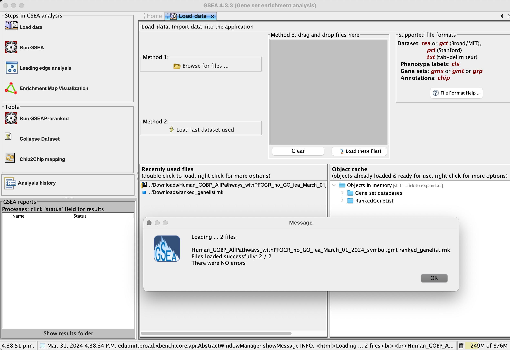

## Parameter Adjustment

Select "GseaPreRanked" button under the "Tools" menu to adjust parameters. There are a few parameters need specifying (Figure.3):
- Gene sets database: choose to use the locally loaded .gmt file downloaded from Bader's Lab
- Number of permutations: set its value to 2000, it is the number of times that the gene-sets will be randomized in order to create a null distribution to calculate the FDR (2000 is recommended by the tutorial provided)
- Ranked list: select the ranked gene list loaded
- Collapse/Remap to gene symbols: choose No_Collapse, since my ranked list of genes already has gene symbols
- Enrichment Statistics: use the default value, which is "weighted"
- Max size & Min size: use the default values suggested (Max 500, Min 15)

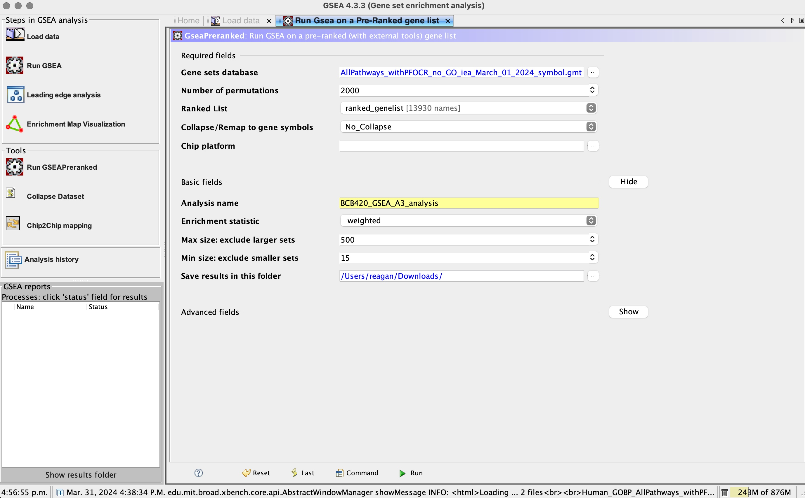


After the parameter adjustment, click the `run` button at the bottom right corner of the window.

It took about 10 minutes to run the analysis. Then I obtained a report (.html) file for the analysis result:

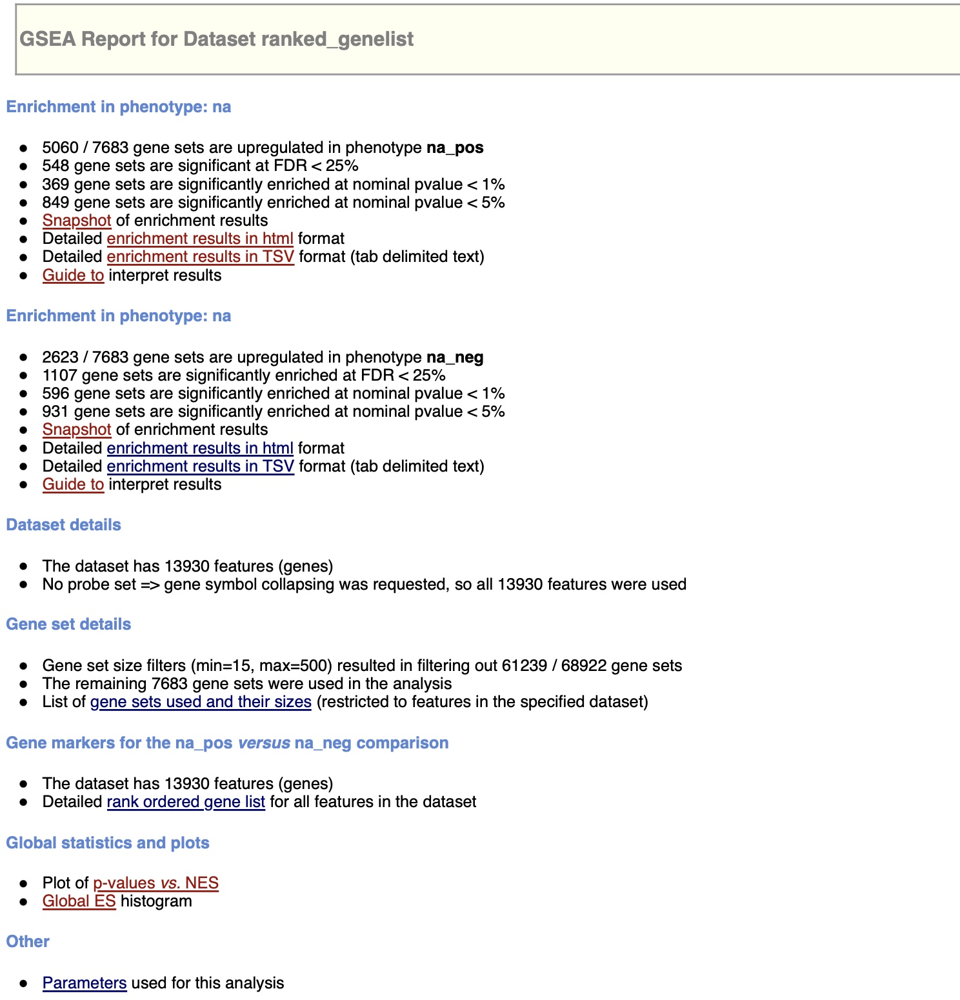


There are two "Enrichment in Phenotype" sections. The first section shows the results for gene sets that have a positive enrichment score (gene sets that show enrichment at the top of the ranked list) and the second section shows results for gene sets that have a negative enrichment score (gene sets that show enrichment at the bottom of the ranked list) (Figure.4).

It is easy to see that we have 7683 gene sets included in the analysis, 5060 of them are enriched with up-regulated genes, 2623 of them are enriched with down-regulated genes (Figure.4). 

Among those 5060 gene sets with positive enrichment scores, 548 gene sets are significantly enriched with a false discovery rate (FDR) less than 25%, 369 gene sets have p-value less than 0.01, 849 gene sets have p-value less than 0.05 (Figure.4). 

And among those 2623 gene sets, 1107 gene sets are significantly enriched with a false discovery rate (FDR) less than 25% as well, 596 gene sets have p-value less than 0.01, 931 gene sets have p-value less than 0.05 (Figure.4).  

The value for gene sets with FDR less than 25% could be used to determine what thresholds to start with when creating the enrichment map later.

Additionally, the enrichment results snapshot displays the top 20 enrichment plots with the highest absolute normalized enrichment scores. It is evident that, for the positive phenotype, those top 20 gene sets exhibit a left-skewed distribution, indicating a predominance of up-regulated genes. Conversely, for the negative phenotype, the top 20 gene sets display a right-skewed distribution, signifying a predominance of down-regulated genes. (Here due to the space limit, just show the top 9 plots)

**Enrichment Plots for Up-regulated genes:**

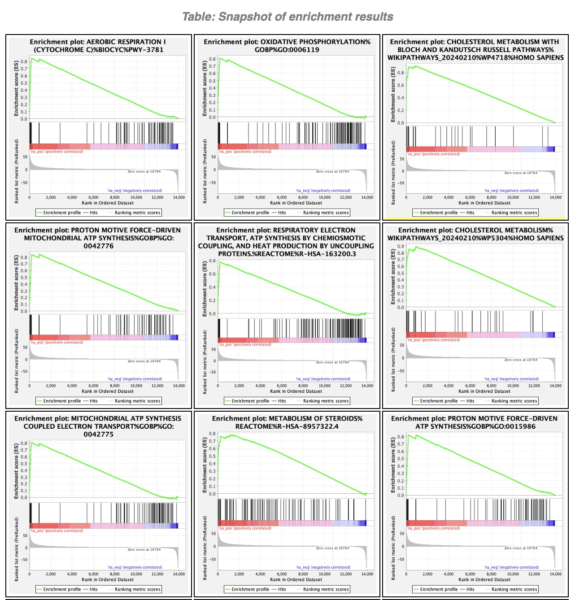 


**Enrichment Plots for Down-regulated genes:**

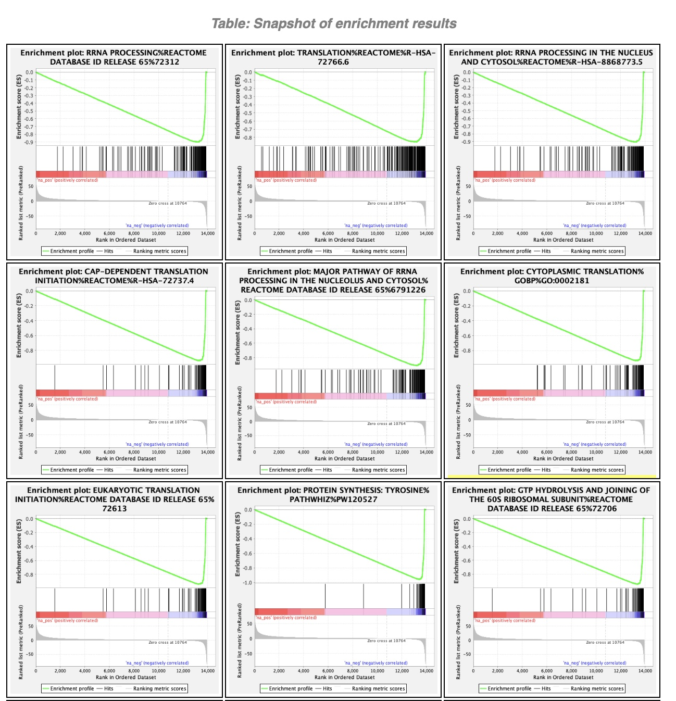


## Questions

**What method did you use? What genesets did you use? Make sure to specify versions and cite your methods.**

I decided to use the GSEA [@gsea] to perform the Gene Set Enrichment Analysis, since it is the most widely-used method for Gene Set Enrichment Analysis, and I used to have experience in using it. Also it provides a desktop user-friendly application, which is straightforward and easy to use. 

The gene sets that I use is the human pathway definition with GO biological processes, but without IEA (inferred from electronic annotation), which is downloaded directly from the Dr.Bader's Lab website. The version for the gene sets file is the latest version, which is April_01_2024 when I finish this assignment 3. 

**Summarize your enrichment results.** (This part is just a copy paste from the above summary of the enrichment results, please refer the scrrenshots above)

There are two "Enrichment in Phenotype" sections. The first section shows the results for gene sets that have a positive enrichment score (gene sets that show enrichment at the top of the ranked list) and the second section shows results for gene sets that have a negative enrichment score (gene sets that show enrichment at the bottom of the ranked list).

It is easy to see that we have 7683 gene sets included in the analysis, 5060 of them are enriched with up-regulated genes, 2623 of them are enriched with down-regulated genes. 

Among those 5060 gene sets with positive enrichment scores, 548 gene sets are significantly enriched with a false discovery rate (FDR) less than 25%, 369 gene sets have p-value less than 0.01, 849 gene sets have p-value less than 0.05. 

And among those 2623 gene sets, 1107 gene sets are significantly enriched with a false discovery rate (FDR) less than 25% as well, 596 gene sets have p-value less than 0.01, 931 gene sets have p-value less than 0.05.  

The value for gene sets with FDR less than 25% could be used to determine what thresholds to start with when creating the enrichment map later.

Additionally, the enrichment results snapshot displays the top 20 enrichment plots with the highest absolute normalized enrichment scores. It is evident that, for the positive phenotype (Glu_Gln), those top 20 gene sets exhibit a left-skewed distribution, indicating a predominance of up-regulated genes. Conversely, for the negative phenotype (control), the top 20 gene sets display a right-skewed distribution, signifying a predominance of down-regulated genes.

**How do these results compare to the results from the thresholded analysis in Assignment #2. Compare qualitatively. Is this a straight forward comparison? Why or why not?**

Though there are maybe some of the top hits gene sets for up-regulated and down-regulated genes can be found in both the analysis from assignment 2 and analysis in this assignment, the majority of the gene sets/pathways are quite different. For example, for up-regulated genes, I almost can't find the same/similar pathways/genesets appear in both analysis from assignment2 and 3. For down-regulated genes, I can find some same pathways/genesets for both analysis in assignment2 and 3, such as the Cytoplasmic Translation and rRNA processing, but most of other pathways/genesets are still quite different. In my opinion, this is not a straight forward comparison, cause we use different input genes (in assignment 2, we used threholded genes, in assignment3 we use Non-thresholded genes), also we use different tools with different algorithms, different threholds etc. Many conditions are various, and also the genesets/pathways database used are also different. Therefore, the result should not be compared directly.

# Visualize Gene set Enrichment Analysis in Cytoscape

I am going to use the desktop App of EnrichmentMap to create an enrichment map for the result of GSEA. Two files are required, one table (pos) contains all pathways with an positive enrichment score, one table (neg) contains all pathways with an negative enrichment score.

There are a few parameters to set:

- Analysis Type: set as `GSEA`, since the gene set enrichment analysis is performed by GSEA

- Enrichments Pos & Enrichments Neg: two required files mentioned above

- GMT: the pathway definition file used by GSEA

- Ranks: ranked gene list (.rnk) used by GSEA

- Expressions: I use the normalized expression matrix data generated from Assignment 1

- FDR q-value cutoff: set the cutoff to 0.0001 as recommended by the tutorial

All other parameters are either not required or keeping as default values (as shown below).


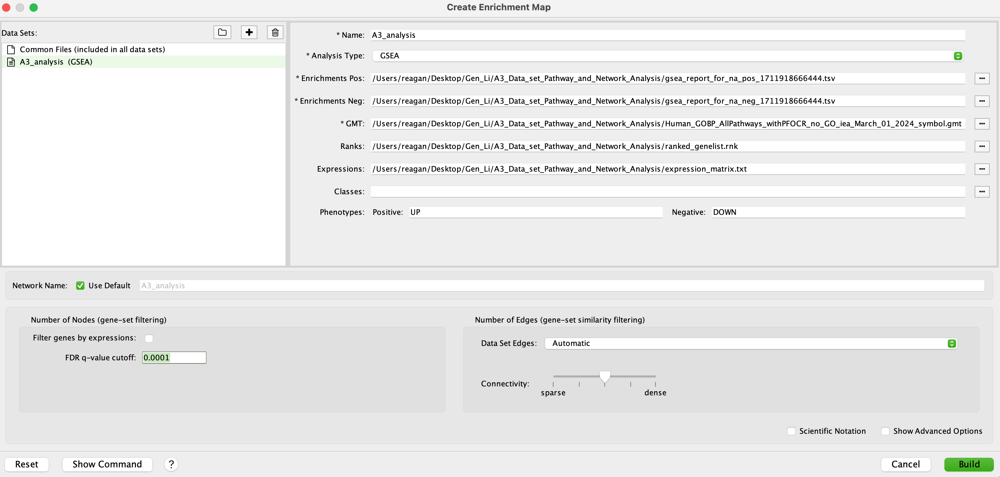


This is the Enrichment Map generated without manual layout:


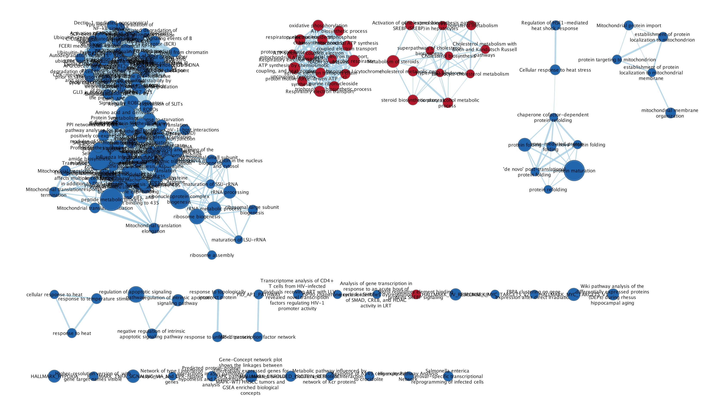


After this, I manually arrange the nodes and annotate the Enrichment map. To annotate it, I use mainly use WordCloud, ClusterMaker and Autoannotate Apps in Cytoscape. The parameters for creating an annotated enrichment map are kept as default as shown below:


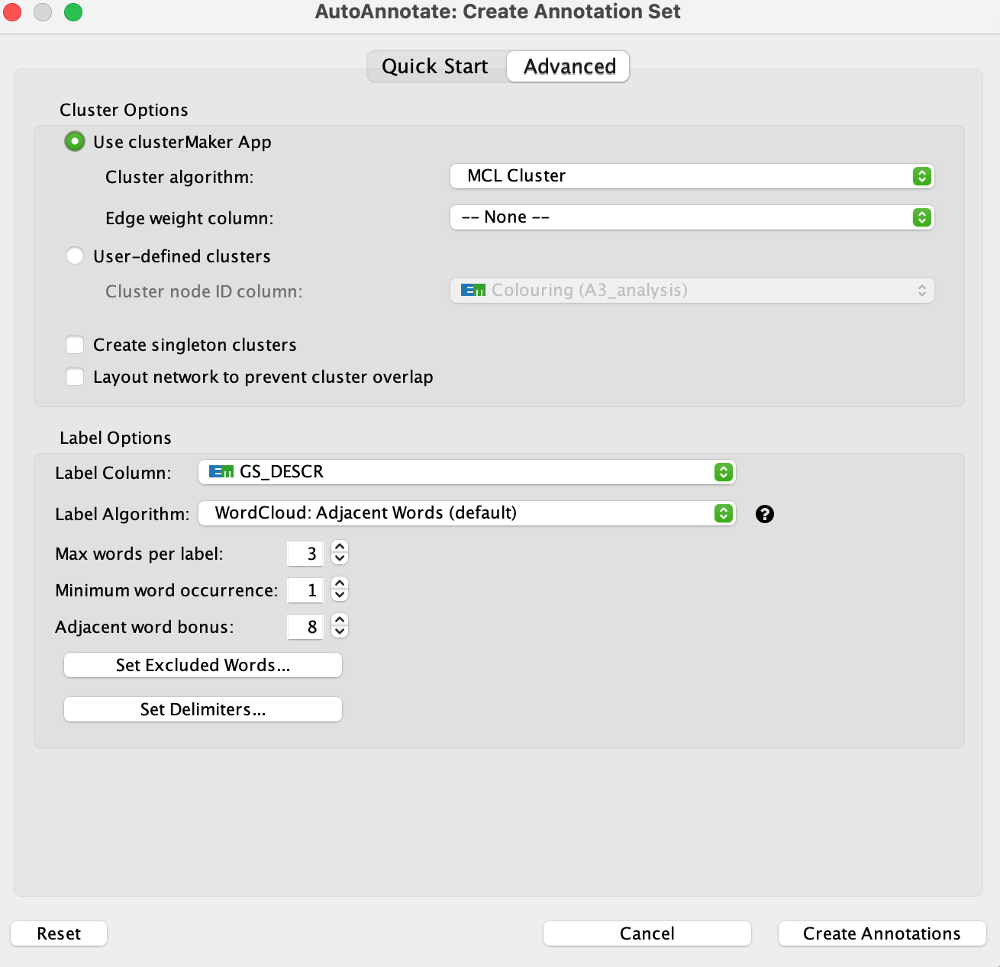


Below is the initial result of annotation of the enrichment map:


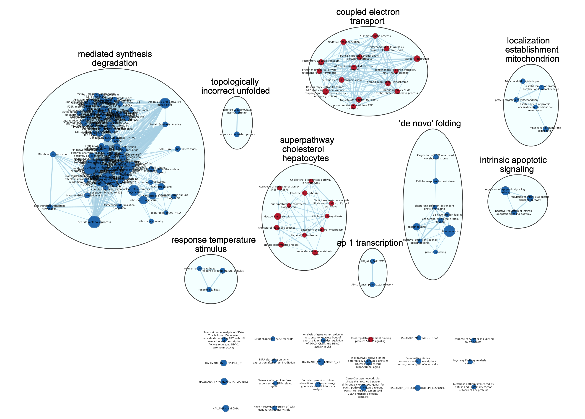

After optimizing and adding legend, this is the current ready to publish version of the enrichment map:

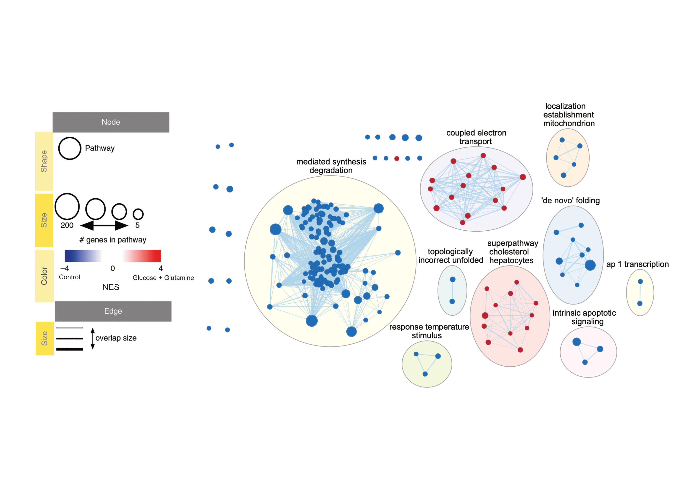

## Questions
**Create an enrichment map - how many nodes and how many edges in the resulting map? What thresholds were used to create this map? Make sure to record all thresholds. Include a screenshot of your network prior to manual layout.**

There are 196 nodes and 3246 edges in the resulting map. I set the FDR q-value as 0.0001 to create this map, and the threshold for edge similarity is 0.375. The screenshot of your network prior to manual layout can be found above in Figure.8.

**Annotate your network - what parameters did you use to annotate the network. If you are using the default parameters make sure to list them as well.**

The parameters used for the annotation of the network can be found in the Figure.9. Basically, I chose to use clusterMaker App and "MCL CLuster" as the cluster algorithm. I also set the edge weight column as None, and not checking "create singleton clusters" and "Layout network to prevent cluster overlap". For label options, I chose to use the "WordCloud: Adjacent Words" algorithm. Apart from that, I set "Max words per label" as 3, "Minimum word occurrence" as 1, "Adjacent word bonus" as 8. And these are the default parameters. I also manually arrange the nodes to prevent the overlap.

**Make a publication ready figure - include this figure with proper legends in your notebook.**

The publication ready figure can be found at Figure.11.

**Collapse your network to a theme network. What are the major themes present in this analysis? Do they fit with the model? Are there any novel pathways or themes?**

The network is collapsed to a theme network, where each cluster are collapsed into a single node (Figure.12). The major theme present in this analysis is the metabolism (synthesis and degradation) and process related to cholesterol metabolism in hepatocytes (Figure.11 and Figure.12). These themes fit well with the model, since the model described in the original [paper](https://pubmed.ncbi.nlm.nih.gov/35534729/)[@Cheng2022] shows the relationship between the experiment conditions with the synthesis of fatty acid and cholesterol. No novel pathways or themes are found.

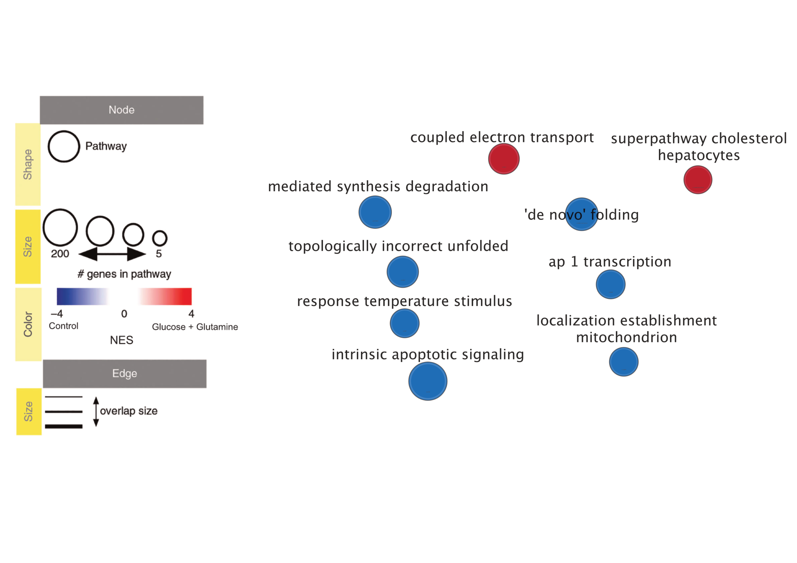
# Interpretation and detailed view of results

**Do the enrichment results support conclusions or mechanism discussed in the original paper? How do these results differ from the results you got from Assignment #2 thresholded methods**

Yes, the enrichment result here support the mechanism discussed in the original [paper](https://pubmed.ncbi.nlm.nih.gov/35534729/)[@Cheng2022]. The result shown in the original [paper](https://pubmed.ncbi.nlm.nih.gov/35534729/)[@Cheng2022] shows that with the consumption of Glucose and Glutamine, genes that are related to the synthesis of fatty acid and cholesterol are up-regulated. The result of the enrichment analysis shows that up-regulated genes are enriched in some pathways that are related to metabolism and process related to cholesterol. 

This result is a bit different from the result I got from Assignment 2. In assignment 2, the result for thresholded over-representation analysis (ORA) for the pathways for up-regulated/down-regulated genes are mainly related to the cell cycle, components transport (localization), biosynthesis, metabolism and RNA processing, which may indicate that those genes may be highly related to some synthesis or secretion process, which is not as accurate as the result for GSEA (indicating the pathways are related to cholesterol). In conclusion, the result of GSEA returns a more specific and more accurate pathway information related to the genes of interest, but result of ORA returns a more general(not so specific, less informative) pathways. 

**Can you find evidence, i.e. publications, to support some of the results that you see. How does this evidence support your result?**

I have also come across a [paper](https://pubmed.ncbi.nlm.nih.gov/21696544/)[@inoue] that corroborates the findings observed in GSEA analysis. According to this paper, genes associated with lipid homeostasis exhibit a significant correlation with the consumption of glutamine by cells. In my analysis, the pathways that are found to enrich in up-regulated genes with the treatment of glutamine and glucose are related to the metabolism and process of operating cholesterol. Therefore, the paper's result align with what I got from the GSEA here.

**Add a post analysis to your main network using specific transcription factors, microRNAs or drugs. Include the reason why you chose the specific miRs, TFs or drugs (i.e publications indicating that they might be related to your model). What does this post analysis show?**

Since the model we have is studying the relationship between the expression level of genes for fatty acid and cholesterol synthesis and the consumption of glucose and glutamine. I learned from the [paper](https://www.jci.org/articles/view/15593)[@post] that under the physiological conditions, lipid levels are mainly regulated by sterol regulatory element-binding proteins (SREBPs). Therefore, I decided to add drugs that regard SREBPs as targets into the post analysis. According to the data from DrugBank[@drugbank], I am going to add Doconexent, Fish Oil and Omega-3 fatty acids to the enrichment map. The result is shown below:

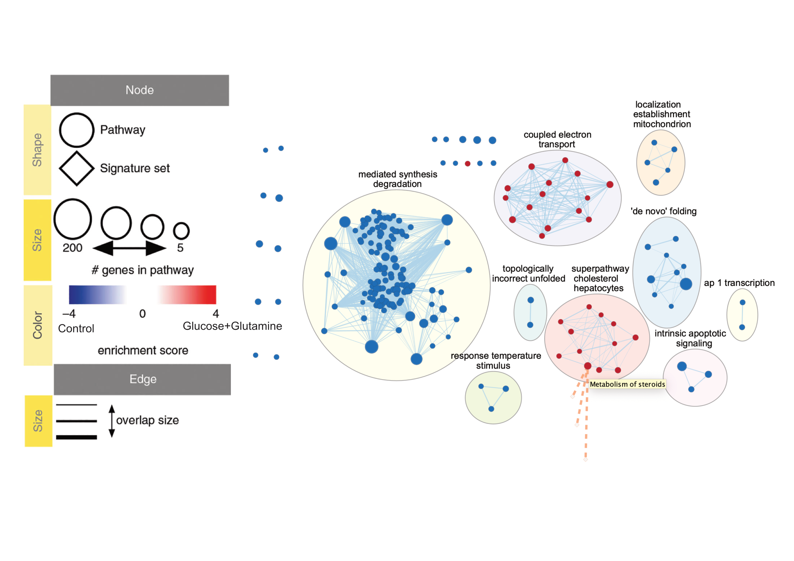

It is easy to see that the signature gene sets for Doconexent, Fish Oil and Omega-3 fatty acids all share genes with the pathway-"Metabolism of steroids". This makes sense cause cholesterol is the sole precursor of steroids [@steroid], which may indicate that those drugs have effect on some genes that really participate in the reasonable biological processes.

# References: